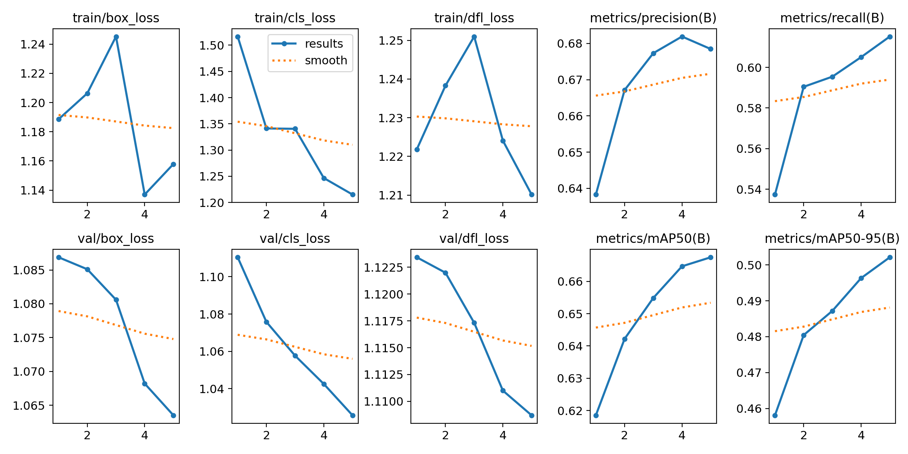

## MNIST El Yazısı Rakam Sınıflandırıcı

PyTorch'a giriş projem. İki farklı model mimarisini (basit sinir ağı ve CNN)
karşılaştırarak, konvolüsyonel katmanların görüntü işlemedeki etkisini inceledim.

### Sonuçlar

| Model | Test Doğruluğu |
|---|---|
| Basit Sinir Ağı (Fully Connected) | %96.67 |
| CNN (Convolutional Neural Network) | **%98.72** |

**Gözlem:** CNN, konvolüsyon katmanları sayesinde piksellerin konumsal
(spatial) ilişkisini koruyabildiği için, basit modele göre daha yüksek
doğruluk ve daha istikrarlı bir eğitim süreci (kayıp değerleri daha düzenli
azaldı) gösterdi.

### Kullanılan yöntemler
- PyTorch tensor ve otomatik gradyan hesaplama (autograd)
- `nn.Sequential` ile iki farklı model mimarisi
- Conv2d, MaxPool2d katmanları (CNN mimarisi)
- Adam optimizer ve CrossEntropyLoss kayıp fonksiyonu
- Eğitim/test verisi ayrımı ile gerçek performans ölçümü

**Neden yaptım:** PyTorch'un temel kavramlarını (tensor, gradyan, epoch) ve
görüntü işlemede neden CNN mimarisinin tercih edildiğini uygulamalı olarak
öğrenmek için. Bu, ileride görüntü işleme ve otonom sistemler alanında
yapacağım İHA/drone projeleri için bir başlangıç noktası — YOLO gibi
nesne tespiti modelleri de CNN temelli çalışıyor.
## YOLO ile Nesne Tespiti Denemesi

Hazır, önceden eğitilmiş bir YOLOv8n modelini kullanarak, bir resimde nesne
tespiti yaptım. Bu, sınıflandırma (MNIST/CNN) ile nesne tespiti arasındaki
farkı uygulamalı olarak görmek içindi.

**Sonuç:** Model, test resminde 4 kişi, 1 otobüs ve 1 dur işaretini,
güven skorlarıyla birlikte (örn. otobüs %87.3) tespit etti — 110ms gibi
gerçek zamanlı sayılabilecek bir sürede.

**Öğrendiklerim:**
- Sınıflandırma "ne var" sorusuna, nesne tespiti "ne var + nerede" sorusuna cevap verir
- Hazır bir model kullanmak (inference) ile bir modeli eğitmek (training) farklı şeyler
- Güven skoru (confidence), modelin bir tespitten ne kadar emin olduğunu gösterir
- YOLO'nun nano versiyonu, hız öncelikli senaryolar (örn. Jetson Nano üzerinde
  gerçek zamanlı çalışma) için tercih ediliyor

**Sıradaki hedefim:** Kendi etiketlediğim İHA/drone görüntü verisiyle,
hazır bir model kullanmak yerine kendi YOLO modelimi sıfırdan eğitmek.
## YOLO Fine-Tuning Denemesi (COCO128)

Hazır bir YOLOv8n modelini, küçük bir örnek veri seti (COCO128, 128 resim,
80 farklı nesne kategorisi) ile 5 epoch boyunca fine-tune ettim. Bu, ileride
kendi etiketlediğim İHA/drone verisiyle yapacağım eğitim sürecinin bir provasıydı.

**Genel sonuçlar (5 epoch sonunda):**
- Precision: 0.674
- Recall: 0.617
- mAP50: 0.667
- mAP50-95: 0.502

**Önemli gözlem:** Sınıf bazlı performans, o sınıftaki örnek sayısına doğrudan
bağlıydı — örneğin "person" sınıfı (254 örnek) yüksek performans gösterirken,
"car" sınıfı (sadece 46 örnek) düşük kaldı (Precision: 0.482, Recall: 0.239).
Bu, kendi İHA veri setimi hazırlarken her kategoriden yeterli örnek
etiketlemem gerektiğini gösteren değerli bir ders oldu.

**Öğrendiklerim:**
- Fine-tuning: hazır, önceden eğitilmiş bir modeli az veriyle "ince ayar" yapmak
- Precision/Recall/mAP değerlerinin eğitim sürecinde nasıl geliştiğini okumak
- box_loss, cls_loss, dfl_loss metriklerinin ne anlama geldiği
- Az örnekli kategorilerin model performansını nasıl olumsuz etkilediği